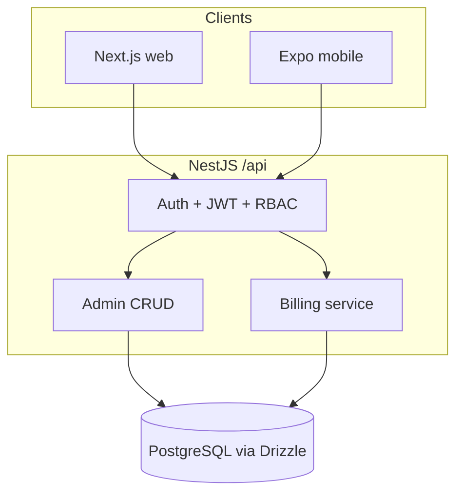
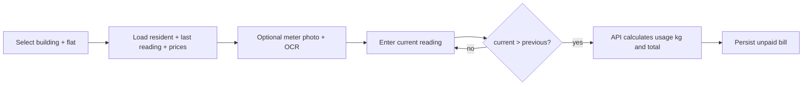
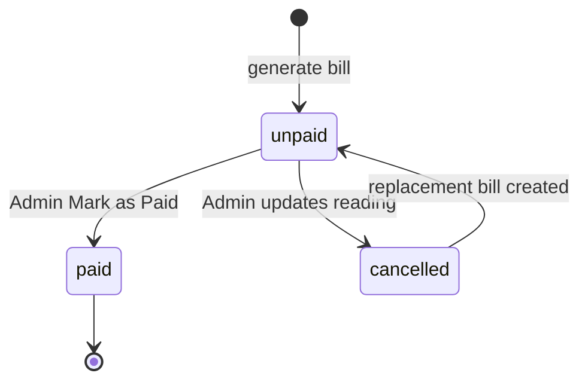

# PRRMS — LPG Reticulation Billing System

Monorepo for **Protik Ruposree Residential Management System (PRRMS)**: role-based LPG (piped gas) billing for buildings, flats, staff, and residents.

Web portals, a NestJS API, and an optional Expo app share one PostgreSQL database. All money math runs on the server.

## Stack

- **Web:** Next.js 16 (App Router, React 19) + Tailwind CSS + Lucide
- **Mobile:** Expo (React Native) — resident login, unit price, billing history
- **API:** NestJS 11, modular (`auth`, `admin`, `billing`, `management`, `database`)
- **Data:** PostgreSQL + Drizzle ORM
- **Auth:** JWT + RBAC (`admin`, `building_admin`, `staff`, `user`)
- **Meter OCR (web):** Tesseract.js on the client; reading stays editable

## Workspace

```
bdrms/
├── apps/web          Next.js portals (admin, staff, resident)
├── apps/api          NestJS REST API (global prefix /api, default port 4000)
├── apps/mobile       Expo companion app
└── packages/shared   Shared roles and billing types
```

In-app overview: [http://localhost:3000/docs](http://localhost:3000/docs) after `npm run dev:web`.

To rebuild this system in Cursor from a blank folder, use **[CURSOR_REPLICATION_SPEC.md](./CURSOR_REPLICATION_SPEC.md)**.

## High-level process flow



### 1. Property and people

1. **Admin** creates buildings (name, optional building no, address, post code) and can disable a building.
2. **Admin** (or building admin) creates flats under a building; flat no is unique per building.
3. **Admin** (or building admin) creates **staff** and **standard users** (residents). Resident forms filter flats by building and copy address from the building.
4. Residents may also **self-register** (`/register`) against an active building and flat, with a unique gas meter number.
5. **Admin only** sets **system config**: gas unit name, unit price (per kg), and operating cost per flat.

### 2. Generate a gas bill



- **Admin** and **staff** use Gas Billing Form (one flat) or Bulk Gas Billing (one building).
- Previous reading is the **current reading of that resident’s latest bill**, or `0` if none exists.
- Current reading **must be strictly greater** than previous reading.
- New bills are stored as **`unpaid`**. Billing date is a timestamp (date-only input is combined with server time).
- Optional meter image is stored on the bill (payload size is capped).

### 3. Collect payment and correct readings



- **Unpaid Gas Bills:** list outstanding bills. **Admin only** can **Mark as Paid** or **Update**.
- **Staff** can view unpaid bills but cannot mark paid or edit readings.
- **Update (admin):** only **current reading** changes, with a required reason (max 200 characters). The old bill becomes **`cancelled`**. A new **`unpaid`** bill is inserted with the new totals, `updateReason`, `billUpdatedAt`, `previousBillId` (the cancelled bill), and `createdByUserId`. The cancelled bill gets `supersededByBillId`.
- On update, current reading must be **higher than the last paid bill’s current reading** (when a paid bill exists) **and** greater than this bill’s previous reading.
- **Gas Billing History:** unpaid, paid, and cancelled bills, with links between cancelled and replacement bills. Residents see **only their own** history.

### 4. Resident view

Residents sign in on web (`/user`) or mobile, see current unit price and operating cost, profile, and personal billing history.

## Billing logic

Implemented in `apps/api/src/billing/billing.service.ts`. The UI may preview numbers; **the API is authoritative**.

### Formula

Readings are in **cubic metres (m³)**. Price is per **kilogram**.

```
usageQuantity (m³) = max(0, currentReading − previousReading)
usageKg            = usageQuantity × 1.8315
totalBill          = usageKg × unitPrice + operatingCostPerFlat
```

- `previousReading` defaults to `0` when there is no prior bill.
- `unitPrice` and `operatingCostPerFlat` come from `system_configs` (latest row) at generation time and are **copied onto the bill**. Later config changes do not rewrite old bills.
- On an unpaid-bill **update**, operating cost is **derived from the original bill** so the correction only reflects the reading change:

```
derivedOperatingCost = max(0, originalTotalBill − originalUsageKg × unitPrice)
```

then `calculate()` is run again with the new current reading.

### Rules the API enforces

| Rule | When |
| --- | --- |
| Current reading ≥ 0 and finite | Create and update |
| Current reading **>** previous reading | Create; also on update |
| Current reading **>** last **paid** bill’s current reading | Update unpaid bill (if a paid bill exists) |
| Gas unit price must be configured and > 0 | Create |
| Building must be active | Create (flat context) |
| Duplicate protection | Same meter, same calendar day, same previous/current/total, status not `cancelled` |
| Update reason required, ≤ 200 characters | Update unpaid bill |
| Only `unpaid` bills can be marked paid or updated | Mark paid / update |

`usageQuantity` stored on the bill is **m³** (not kg). Kg is used only when computing `totalBill`.

### Previous reading source

For a flat, previous reading is the **current reading of the latest bill** for that `standard_user_id` (by `billing_date`, then `id`). Cancelled bills still sit in that timeline; a replacement unpaid bill keeps the **same previous reading** as the bill it replaces.

### OCR

Web billing forms can run Tesseract.js on a meter photo and fill current reading. The API `POST /billing/ocr` is a **placeholder** (parses digits from a string). Staff/admin can always type the reading by hand.

## Roles and access

| Capability | Admin | Building admin | Staff | Resident |
| --- | --- | --- | --- | --- |
| Buildings CRUD, enable/disable | Yes | No | No | No |
| System config (prices) | Yes | No | No | No |
| Flats, staff, standard users | Yes | Yes | No | No |
| Generate bills (single + bulk) | Yes | Yes | Yes | No |
| Unpaid list | Yes | Yes | View only | No |
| Mark paid / update unpaid reading | Yes | No* | No | No |
| Billing history | All meters | All meters | All meters | Own bills only |
| Register / profile | — | — | Own profile | Own profile |

\*Mark-paid and unpaid update are `@Roles(Admin)` only (not `building_admin`). Building admin uses the admin web shell but without Buildings and Configuration in the nav.

JWT payload: `{ sub, userName, role }`. Web and mobile store `accessToken` and `userRole` in local storage and send `Authorization: Bearer …`.

If no `users` row matches the login name, the API currently issues a **demo JWT** from the username prefix (`admin…` → admin, `staff…` → staff, otherwise resident). After `seed:admin`, `admin` / `admin123` is a **real** user and the password is checked.

## Other implementation notes

- **API prefix and CORS:** global prefix `api`, CORS enabled, JSON body limit 12mb (meter images). Default port **4000**.
- **Web API URL:** `NEXT_PUBLIC_API_BASE_URL` or `http://localhost:4000/api`.
- **Guards:** `JwtAuthGuard` + `RolesGuard` on protected controllers.
- **Passwords:** scrypt hashes in `users.password_hash`.
- **Disabled buildings:** excluded from registration lists; billing a flat in a disabled building is rejected.
- **Exports:** unpaid list and history support CSV and PDF (jsPDF) on the web.
- **Bill detail:** shows readings, totals, status, optional meter image, update reason, update time, and links to previous / superseding bills.

## Quick start

Prerequisites: Node.js LTS, npm, PostgreSQL.

```bash
npm install
cp apps/api/.env.example apps/api/.env   # set DATABASE_URL and JWT_SECRET
npm run db:push -w api                    # apply schema
npm run seed:admin -w api                 # admin / admin123
npm run dev:api                           # http://localhost:4000/api
npm run dev:web                           # http://localhost:3000
npm run dev:mobile                        # optional Expo app
```

Optional: `npm run seed:building-admin -w api`, `npm run seed:sample -w api`.

After schema changes:

```bash
npm run db:generate -w api
npm run db:push -w api
```

## Environment

| App | File | Required |
| --- | --- | --- |
| API | `apps/api/.env` | `DATABASE_URL`, `JWT_SECRET`, optional `PORT` |
| Web | `apps/web/.env.local` | optional `NEXT_PUBLIC_API_BASE_URL` |
| Mobile | `apps/mobile/.env` | `EXPO_PUBLIC_API_BASE_URL` (LAN IP on a device; `10.0.2.2` on Android emulator) |

Schema source of truth: `apps/api/src/database/schema.ts`. SQL snapshots live under `apps/api/drizzle/`.

---

By A S M Abdur Rab, Email: shibly.dhk@gmail.com, LinkedIn: https://www.linkedin.com/in/shibly/

## Technology Stack Icons

[](https://nextjs.org/)
[](https://react.dev/)
[](https://tailwindcss.com/)
[](https://nestjs.com/)
[](https://www.postgresql.org/)
[](https://orm.drizzle.team/)
[](https://jwt.io/)
